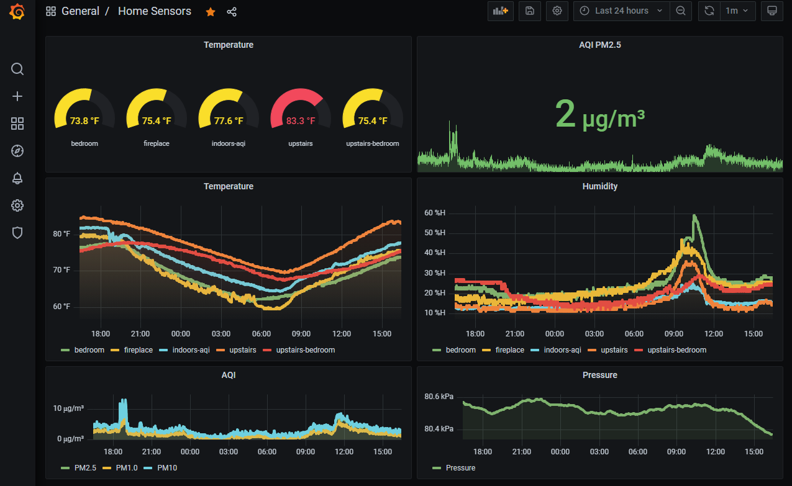

# Sensor Network
This is a network of sensors to monitor various environmental characteristics at a location. So far, there is support for temperature/humidity nodes (based on an HT11 sensor), and particulate/AQI monitoring based on a Plantronics PMS5003 sensor.

The sensor data are reported from each node over MQTT to a central server, which runs an MQTT daemon, an InfluxDB database, and a Grafana display interface. The server can be any computer, but I'm using a Raspberry Pi. I have it set up running an avahi mdns daemon to give it a local address at `http://<pi-hostname>.local`.

# Setup

## Sensor Nodes
The hardware and software configurations for each of the nodes are documented in their respective folders:
- [air-quality-node](air-quality-node/) - An air quality sensor node, measuring particulate concentration and other environmental values.
- [temp-node](temp-node/) - An air temperature and humidity node.

## Server
You'll need to have [Mosquitto](https://mosquitto.org/) or some other MQTT broker/server running. To install on Linux and enable the broker service, run the following:
```
sudo apt update
sudo apt install -y mosquitto mosquitto-clients
sudo systemctl enable mosquitto.service
```

There is then a local MQTT client that runs on the server (or elsewhere on the network) to grab messages and shove them into an InfluxDB database. To run this MQTT client, run:
```
python3 -m pip install paho-mqtt influxdb
python3 influxdb/mqtt_influxdb_bridge.py
```

Then set up your Grafana instance to point to the InfluxDB (good tutorial [here](https://grafana.com/docs/grafana/latest/getting-started/getting-started-influxdb/)), create a dashboard with the fields you want, and you'll end up with something like this:


