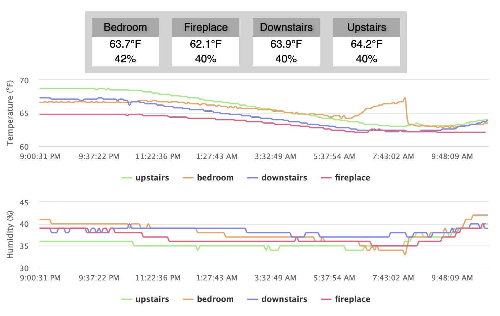

# Sensor Network
This is a network of sensors to monitor various environmental characteristics at a location. So far, there is support for temperature/humidity nodes (based on an HT11 sensor), and particulate/AQI monitoring based on a Plantronics PMS5003 sensor.

The sensor data are reported from each node over MQTT to a central server, which runs an MQTT daemon, an InfluxDB database, and a Grafana display interface. The server can be any computer, but I'm using a Raspberry Pi. I have it set up running an avahi mdns daemon to give it a local address at `http://<pi-hostname>.local`.

# Setup

## Sensor Nodes
The hardware and software setups for each of the nodes are documented in their respective folders:
[air-quality-node](air-quality-node/)
[temp-node](temp-node/)

## Server
You'll need to have [Mosquitto](https://mosquitto.org/) or some other MQTT broker/server running. This doesn't have to be on the same machine that's serving the status page, but it's OK if it is. To install on Linux and enable the broker service, run the following:
```
sudo apt update
sudo apt install -y mosquitto mosquitto-clients
sudo systemctl enable mosquitto.service
```

To set up the webserver, cd into the `status-page` directory and run `python3 setup.py install`. This will install the python dependencies for you (assuming you already have python3 installed).

To manually launch the MQTT and HTTP servers, run:
```
python3 mqtt-client.py&
python3 status-page.py&
```
Once these are running, you should be able to view the status webpage at [http://localhost/](http://localhost/) or any other address that resolves to the server. All of the sensors on your network should automagically come up and show both their current readings and a time history.

Here's an example of what the page looks like with four sensors connected:
