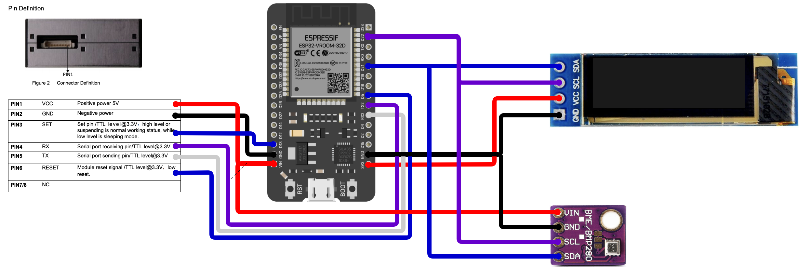
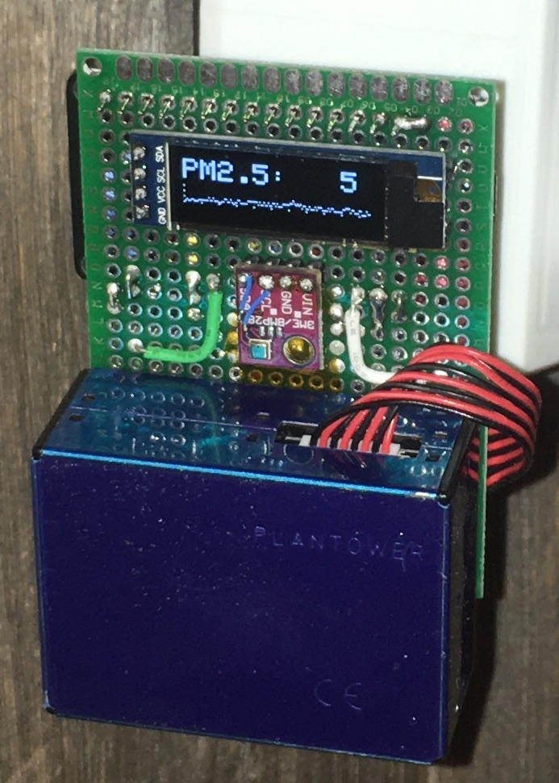

# Air Quality Node
This is a sensor node based around the [Plantower PMS5003](http://www.plantower.com/en/content/?108.html) particulate sensor. It also features a [BME280](https://www.bosch-sensortec.com/products/environmental-sensors/humidity-sensors-bme280/) pressure/temperature/humidity sensor that may be used to help perform live corrections on the particulate sensor readings. Lastly, there is an [SSD1306-compatible 132x28 OLED display](https://www.amazon.com/HiLetgo-Serial-Display-SSD1306-Arduino/dp/B01N0KIVUX/) that is used to display live readings as well as a history chart of past readings.


## Hardware Setup
This node uses an ESP32 processor board (vs. the ESP8266 used on other sensor nodes), mostly because it's what I had on hand. The sensors and ESP32 are wired up as follows:



I wired it up on a perfboard, and it ended up looking like this:




## Software Setup
Rename `arduino_secrets.h.example` to `arduino_secrets.h` and change the wifi SSID and password in it to match the network you wish to attach to.

You'll need to have the Arduino-cli toolchain and gnu make installed. Once those prerequisites are satisfied, open a command line in the `air-quality-node` subdirectory, and run the following with the ESP32 connected to your computer:
```
make config-tools
make program
```
Note that you may have to edit the serial port defined at the top of the Makefile.

Once programming is complete, open a web browser to [http://unnamed.local/](http://unnamed.local/). This will show you a simple status page verifying that the particulate sensor readings are working. Additionally, this page allows you to rebrand the sensor node with a more useful name (e.g. "bedroom", "upstairs", etc.). This name will be used for the URL and MQTT topic, so it can't have any spaces or other weird characters in it.
